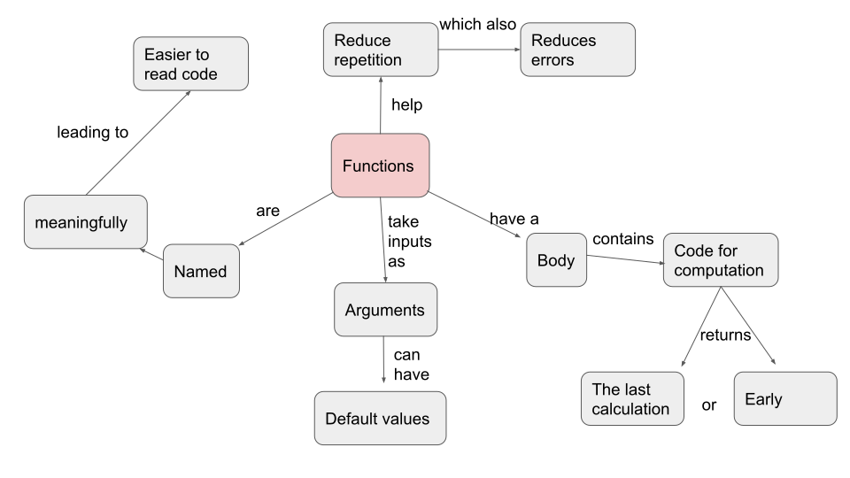

```{r setup, include = FALSE}
library(learnr)
library(parsons)

knitr::opts_chunk$set(echo = FALSE)
```

## Concept Map

```{r}

```

## Learner Persona

Ella is an undergrad environmental science student in Toronto. She is in her late twenties and already has a liberal arts diploma, so is a bit older than a lot of her peers at school. She grew up in Toronto and spent the last few years working as an admin at her local community centre, where she continues to work part-time while in school, taking a few hours off work every Tuesday and Thursday for her lectures.

Ella has taken one intro data science course intended for first-year students who aren't statistics or computer science majors. She knows how to manipulate and summarise data with the tidyverse, how to make some pretty good-looking plots with ggplot2, and write PDF reports with RMarkdown. She also did a capstone project for her course looking at pollution data from Tidy Tuesday.

Ella has gotten hired for a summer research position with one of her professors, looking at pollution. She'll have to clean data from a bunch of different sources, and write a report for each. The position starts in a few months and she knows that she will need to up her R skills a bit to work with messier data, so she's trying to learn as much R as possible during reading week, since she has some "free time" that would normally be taken up by lectures. Her rent (like most in Toronto) is way too high and she's nervous that her RA position will pay less than her admin job does, but hopes it will be worth it.

## Slides

```{r}
knitr::include_url("https://writing-functions-in-r.netlify.app/")
```
  
## Exercises

### Composing functions

**Rearrange the following lines of code to create a function.**

```{r rearrange-function}
question_parsons(
  initial = c(
    "}",
    "last_element <- function(x) {",
    "x[[length(x)]]"
  ),
  pass_if(
    c(
      "last_element <- function(x) {",
      "x[[length(x)]]",
      "}"
    )
  ),
  submit_button = "Submit answer"
)
```

### Naming functions

```{r naming}
question(
  "Imagine you're writing a function to convert kilograms to pounds. Which name would you choose for your function?",
  allow_retry = TRUE,
  random_answer_order = TRUE,
  answer("convert_kg_to_lb()", correct = TRUE, message = "Yes! The name is clear as to what it does - converts kilograms to pounds - and reads \"in English\" without ambiguity as to what it does"),
  answer("weight_converter()", message = "This function name does not clearly convey which way the conversion is happening - are pounds being converted to kilograms, or vice versa? What units are used? Ounces? It would likely result in more misuse, or the need to read the function code to understand."),
  answer("kgtolb()", message = "While this name conveys that kg are being converted to pounds, it is difficult to read all as one word."),
  answer("Kilogram_ToPounds()", message = "This function name combines two popular naming conventions - snake_case and camelCase. Combining both would likely make it more difficult for you to remember the function name when the time comes to use it.")
)
```

### Arguments

```{r arguments-order}
question("Imagine you want to write a function that returns the mean and variance of a vector, with the option to remove `NA` values. What arguments would you include in the function, and in what order? If it is helpful, run `?mean` or `?var` to look at the arguments they use.",
  allow_retry = TRUE,
  random_answer_order = TRUE,
  answer("x, na.rm", correct = TRUE, message = "Yes - the same arguments as `mean` and `var`, in the same order"),
  answer("x, y, na.rm", message = "`y` is not needed to get the var of a single vector - only for calculating the covariance."),
  answer("na.rm, x", message = "Right arguments, wrong order - confusing for people who are used to mean and var."),
  answer("x, remove.na", message = "`remove.na` is a different \"name\" for `na.rm`, but one that's not commonly used - it would be confusing and hard to remember the syntax.")
)
```

### Default Arguments

```{r argument-default}
question("What would you use as the default value for `na.rm` in `mean_and_var`? Again, if it's helpful, look at `?mean` and `?var`.",
  allow_retry = TRUE,
  random_answer_order = TRUE,
  answer("`FALSE`", correct = TRUE, message = "Yes! This is the value used by both `mean` and `var` - for consistency, it is good to use the same default value so you can expect the same behaviour."),
  answer("`TRUE`", message = "`mean` and `var` both use `na.rm = FALSE` as the default, so it may be confusing and inconsistent if `mean_and_var` removes the `NA`s by default.")
)
```
